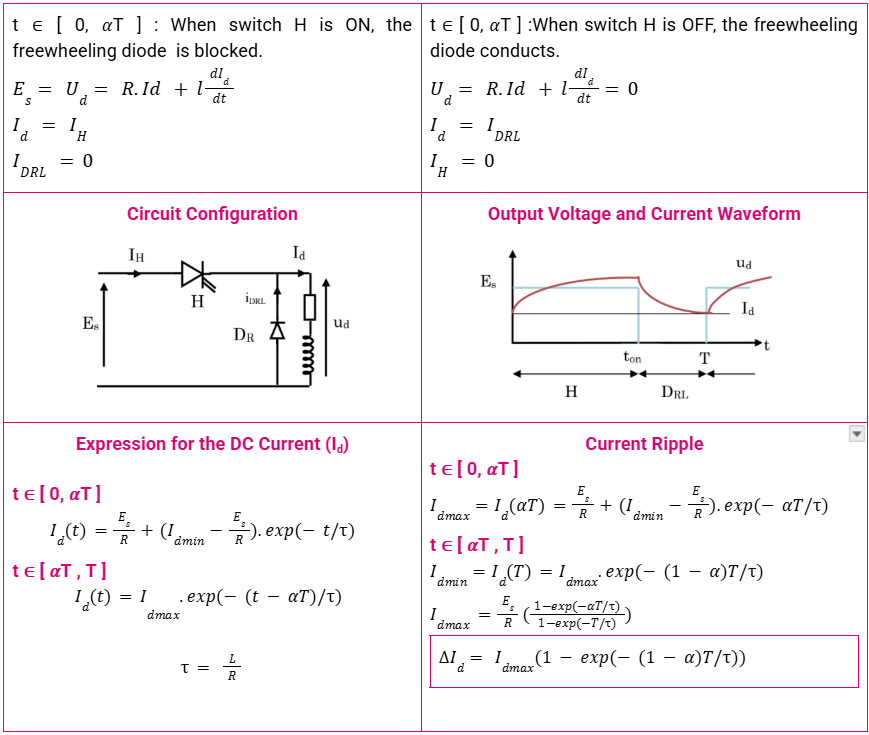
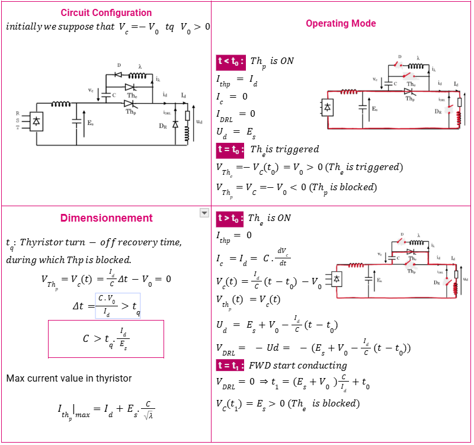
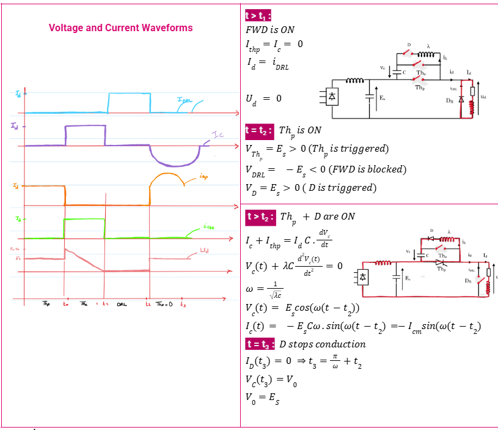
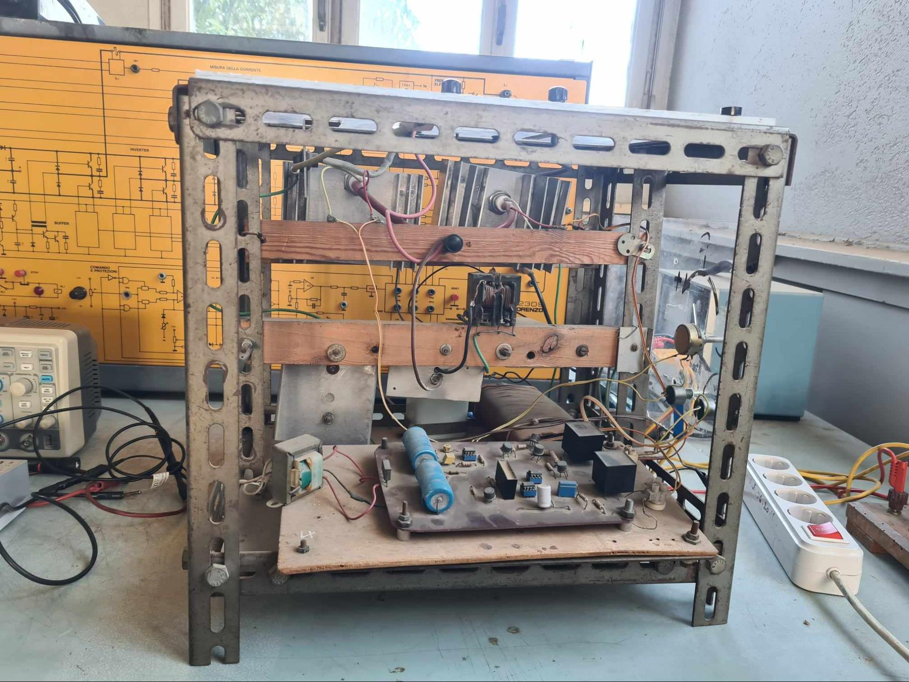
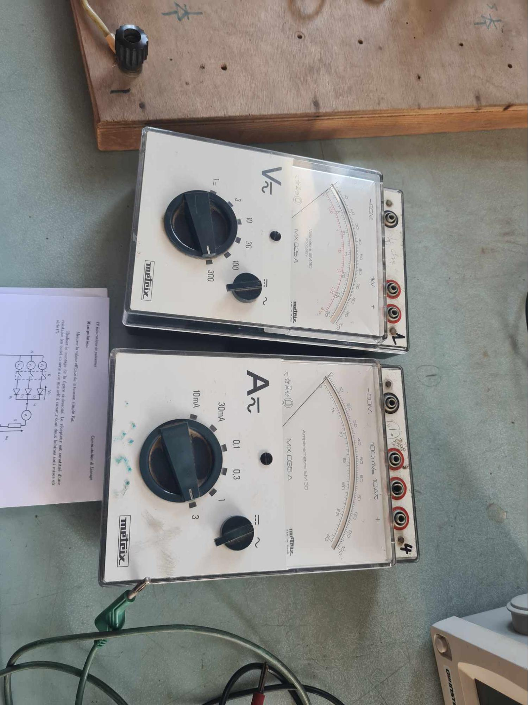
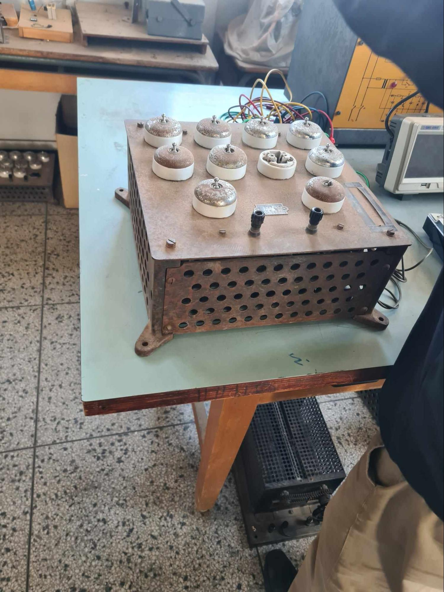
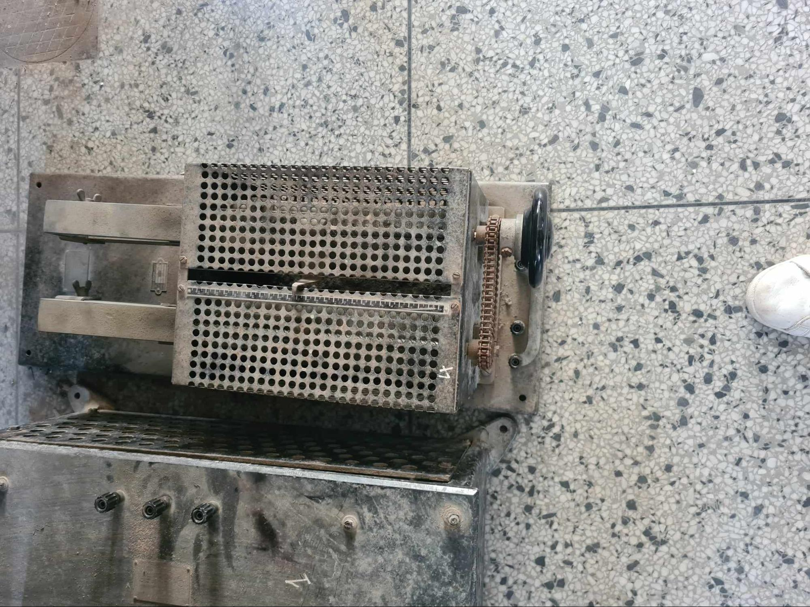
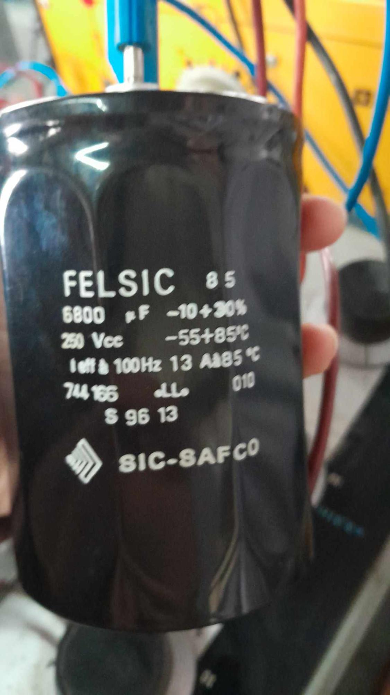

# Experimental-Study-of-Buck-and-Jones-Converters
Experimental study of **thyristor choppers**, focusing on the **Jones chopper** and its forced commutation. The project analyzes waveforms with R-L loads, the effects of inductance and switching frequency on current ripple, and the sizing of chopper components.
<h3>Objectives</h3>

<ul>
  <li>Observe the waveforms for an <strong>R-L load</strong>.</li>
  <li>Study the effect of the <strong>smoothing inductor</strong> and switching frequency on load current ripple.</li>
  <li>Determine the appropriate ratings of the <strong>thyristor chopper components</strong>.</li>
</ul>
<h3>Theoretical Background</h3>

<h3>1. Buck Converter and Jones Converters </h3>

<ul>
  <li>
    <strong>ton</strong>: conduction time of the chopper switch H.
  </li>
  <li>
    <strong>T</strong>: chopper switching period.
  </li>
  <li>
    <strong>&alpha;</strong>: duty cycle, defined as
    <strong>&alpha; = ton/T</strong>, with
    <strong>0 &lt; &alpha; &lt; 1</strong>.
  </li>
</ul>
<h4>Buck Converter</h4>

  

<h4>Jones Converter</h4>

  

  

<h3>Experimental Setup – Jones Chopper</h3>

<table>
  <thead>
    <tr>
      <th>Equipment</th>
      <th>Image</th>
      <th>Description</th>
    </tr>
  </thead>
  <tbody>
    <tr>
      <td><strong>Jones Chopper Assembly</strong></td>
      <td>
        
      </td>
      <td>Thyristor-based chopper used for controlled DC power conversion.</td>
    </tr>
    <tr>
      <td><strong>Oscilloscope</strong></td>
      <td>
        
      </td>
      <td>Used to observe and analyze voltage and current waveforms.</td>
    </tr>
    <tr>
      <td><strong>Voltmeter / Ammeter</strong></td>
      <td>
        
      </td>
      <td>Used to measure the voltage and current in the circuit.</td>
    </tr>
    <tr>
      <td><strong>Three-Phase Switch</strong></td>
      <td>
        
      </td>
      <td>Used to connect and disconnect the three-phase power supply.</td>
    </tr>
    <tr>
      <td><strong>Load Resistor</strong></td>
      <td>
        
      </td>
      <td>Provides the resistive component of the experimental load.</td>
    </tr>
    <tr>
      <td><strong>Load Inductor</strong></td>
      <td>
        
      </td>
      <td>Provides inductive energy storage and allows the study of current ripple.</td>
    </tr>
    <tr>
  <td><strong>MOSFET / IGBT & Ultrafast Diode</strong></td>
  <td>
    
  </td>
  <td>
    Power semiconductor devices used for controlled switching and fast
    current conduction during commutation.
  </td>
</tr>
        <tr>
      <td><strong>Capacitor</strong></td>
      <td>
        
      </td>
      <td>Used for energy storage and voltage smoothing in the chopper circuit.</td>
    </tr>
  </tbody>
</table>
